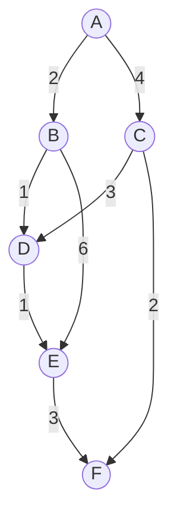
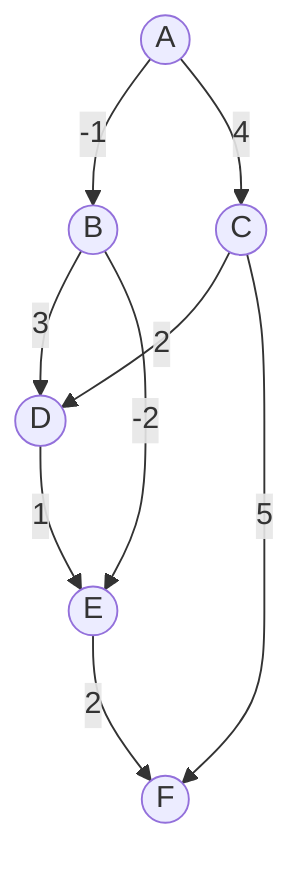
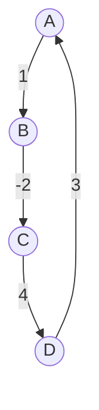
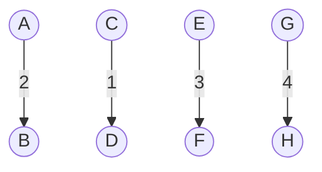
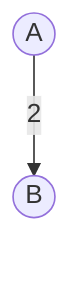

# Bellman Ford Algorithm

The Bellman-Ford algorithm is a widely used algorithm in graph theory and network routing. It is used to find the shortest paths between nodes in a weighted graph, where the edge weights can be negative. This makes it different from Dijkstra's algorithm, which doesn't handle negative weights.

### Characteristics and Requirements of the Bellman-Ford Algorithm

- **Directed Graph:** The algorithm works for both directed and undirected graphs. However, it is primarily used for directed graphs.

- **Negative Weight Edges:** It can handle graphs with negative weight edges, but it cannot handle graphs with negative cycles. If a graph contains a negative cycle, the algorithm will detect it.

### Examples

### 1. Directed Acyclic Graph (DAG):


Vertex B is at distance 2. Path is: B <- A  
Vertex C is at distance 4. Path is: C <- A  
Vertex D is at distance 5. Path is: D <- B <- A  
Vertex E is at distance 8. Path is: E <- F <- C <- A  
Vertex F is at distance 7. Path is: F <- C <- A  

### 2. Negative Weight Edges:


Vertex B is at distance -1. Path is: B <- A  
Vertex C is at distance 3. Path is: C <- A  
Vertex D is at distance 2. Path is: D <- B <- A  
Vertex E is at distance 0. Path is: E <- D <- B <- A  
Vertex F is at distance 7. Path is: F <- C <- A  
Vertex H is at distance 3. Path is: H <- D <- B <- A  

### 3. Graph with Negative Cycle:


A --> B(1) --> C(-2) --> D(4) --> A  
Graph contains negative weight cycle. 

### 4. Graph with Disconnected Components:



Vertex B is at distance 2. Path is: B <- A  
Vertex C is at distance Infinity. Path is: C  
Vertex D is at distance Infinity. Path is: D  
Vertex E is at distance Infinity. Path is: E  
Vertex F is at distance Infinity. Path is: F  
Vertex G is at distance Infinity. Path is: G  
Vertex H is at distance Infinity. Path is: H  


### 5. Single Node Graph:


In this case, there is only one vertex, so the distance from A to itself is 0, and there are no other vertices to reach.

### 6. Single Edge Graph:


Vertex B is at distance 2. Path is: B <- A  

### 7. Graph with No Edges:


Vertex A is at distance 0. Path is: A  
Vertex B is at distance Infinity. Path is:   
Vertex C is at distance Infinity. Path is:   


### Algorithm Steps:

1. **Initialization:**
    - Create two arrays: dist and prev.
        - dist[]: This array will hold the shortest distance from the source vertex to each vertex in the graph.
        - prev[]: This array will hold the preceding node in the shortest path to each vertex.
    - Initialize all dist[] values to infinity (or a very large number), except for the source vertex, which is set to 0.

2. **Relax Edges:**
    - Iterate through all edges (u, v) in the graph.
    - For each edge, check if the distance to the destination vertex v through the source vertex u is shorter than the current known distance. If it is, update dist[v] with the new shorter distance and set prev[v] to u.

3. **Check for Negative Cycles:**
    - After performing all the edge relaxations, perform one more iteration over all edges.
    - If dist[v] > dist[u] + weight(u, v) for any edge (u, v), it means there is a negative cycle in the graph. This step is important to detect negative cycles.


### Implementation

```java
class BellmanFordAlgorithm {

    static class Edge {
        int source, destination, weight;
        Edge(int s, int d, int w) {
            source = s;
            destination = d;
            weight = w;
        }
    }

    static void bellmanFord(Edge[] edges, int V, int E, int source) {
        int dist[] = new int[V];
        int parent[] = new int[V];
        Arrays.fill(dist, Integer.MAX_VALUE);
        dist[source] = 0;

        // Relax all edges V-1 times
        for (int i = 0; i < V - 1; i++) {
            for (int j = 0; j < E; j++) {
                int u = edges[j].source;
                int v = edges[j].destination;
                int weight = edges[j].weight;
                if (dist[u] != Integer.MAX_VALUE && dist[u] + weight < dist[v]) {
                    dist[v] = dist[u] + weight;
                    parent[v] = u;
                }
            }
        }

        // Check for negative cycles
        for (int i = 0; i < E; i++) {
            int u = edges[i].source;
            int v = edges[i].destination;
            int weight = edges[i].weight;
            if (dist[u] != Integer.MAX_VALUE && dist[u] + weight < dist[v]) {
                System.out.println("Graph contains negative weight cycle");
                return;
            }
        }

        // Print the shortest paths
        for (int i = 0; i < V; i++) {
            if (i != source) {
                System.out.print("Vertex " + i + " is at distance " + dist[i] + ". Path is: " + i);
                int j = i;
                while (parent[j] != source) {
                    System.out.print(" <- " + parent[j]);
                    j = parent[j];
                }
                System.out.println(" <- " + source);
            }
        }
    }

    public static void main(String[] args) {
        Edge[] edges = {
                new Edge(0, 1, -1),
                new Edge(0, 2, 4),
                new Edge(1, 2, 3),
                new Edge(1, 3, 2),
                new Edge(1, 4, 2),
                new Edge(3, 2, 5),
                new Edge(3, 1, 1),
                new Edge(4, 3, -3)
        };

        int V = 5;  // Number of vertices
        int E = 8;  // Number of edges
        int source = 0; // Source vertex

        bellmanFord(edges, V, E, source);
    }
}

```

### Complexity Analysis:
- The time complexity of the Bellman-Ford algorithm is O(V * E), where V is the number of vertices and E is the number of edges.
- The space complexity is O(V) for the `dist` and `prev` arrays.

### Limitations:
- In the presence of negative cycles, the algorithm cannot find a correct solution and may report incorrect distances. It can detect the presence of negative cycles but cannot provide a correct path.
- It is less efficient than Dijkstra's algorithm for finding single-source shortest paths in graphs with non-negative weights. Dijkstra's algorithm has a time complexity of `O((V+E)logV)`, which is faster than Bellman-Ford in most cases.