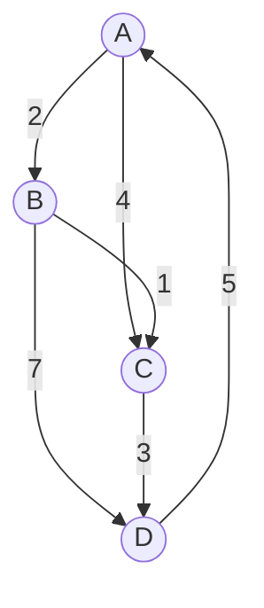
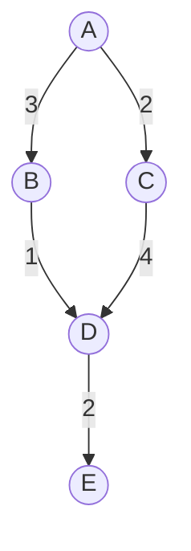
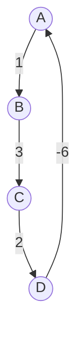
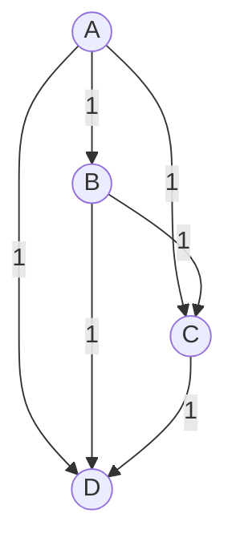
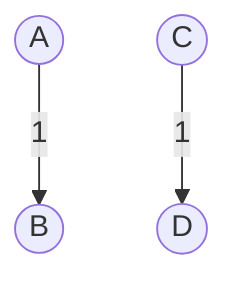

# Floyd Warshall Algorithm

The Floyd-Warshall algorithm is a dynamic programming algorithm used for finding the shortest paths between all pairs of vertices in a weighted directed graph. It is capable of handling graphs with both positive and negative edge weights, as long as there are no negative cycles.

### Examples

Understood! Here are some textual representations of different types of graphs using mermaid.js code:

### Graph 1: Directed Weighted Graph



```
Shortest distances between every pair of vertices:
0	2	3	5	
8	0	1	3	
5	3	0	1	
2	4	5	0	
```

### Graph 2: Weighted Directed Acyclic Graph (DAG)



```
Shortest distances between every pair of vertices:
0	3	2	4	6	
8	0	1	3	5	
5	6	0	1	3	
2	5	3	0	2	
9	2	3	5	0	
```

### Graph 3: Weighted Directed Graph with Negative Edge



```
Shortest distances between every pair of vertices:
0	1	4	-1	
6	0	3	2	
3	2	0	5	
-6	3	2	0	
```

### Graph 4: Complete Graph



```
Shortest distances between every pair of vertices:
0	1	1	1	
1	0	1	1	
1	1	0	1	
1	1	1	0	
```

### Graph 5: Disconnected Graph



```
Shortest distances between every pair of vertices:
0	INF	1	INF	
INF	0	INF	1	
INF	INF	0	INF	
INF	INF	INF	0	
```

### Graph 6: Single Vertex


```
Shortest distances between every pair of vertices:
0	
```

### Key Concepts:
1. **Adjacency Matrix**:
   - The Floyd-Warshall algorithm is usually implemented using an adjacency matrix. This is a 2D array `dist[][]` where `dist[i][j]` is the minimum distance from vertex `i` to vertex `j`.
   - If `i == j`, then `dist[i][j] = 0`.
   - If there is no edge between vertex `i` and `j`, then `dist[i][j]` is considered to be `INF` (infinity).

2. **Initialization**:
   - The algorithm starts by initializing the `dist[][]` matrix. For all vertices `i` and `j`, if there's an edge from `i` to `j`, set `dist[i][j]` to the weight of the edge. Otherwise, set `dist[i][j]` to `INF`.

3. **Main Loop**:
   - The core of the algorithm is a triple nested loop, which iterates over all vertices `k`, `i`, and `j`.
   - For each combination of vertices `i` and `j`, the algorithm checks if there exists a path from `i` to `j` that goes through vertex `k` and if that path is shorter than the current known path from `i` to `j`.

   ```
   for k from 0 to V-1:
       for i from 0 to V-1:
           for j from 0 to V-1:
               dist[i][j] = min(dist[i][j], dist[i][k] + dist[k][j])
   ```

   - `V` is the number of vertices in the graph.

4. **Updating Distances**:
   - For each iteration of the triple loop, the algorithm updates the `dist[][]` matrix based on the following rule:
     - `dist[i][j] = min(dist[i][j], dist[i][k] + dist[k][j])`.
   - This means that the algorithm considers the possibility of going from `i` to `j` directly or going from `i` to `k` and then from `k` to `j`, and chooses the shorter path.

5. **Negative Cycles**:
   - The algorithm can detect negative cycles in the graph. If there exists a negative cycle, the `dist[][]` matrix will have at least one negative value on the diagonal.


```java
public class FloydWarshall {

    static final int INF = 9999; // Represents infinity

    public static void floydWarshall(int[][] graph, int V) {
        int[][] dist = new int[V][V];

        // Initialize dist[][] with the input graph
        for (int i = 0; i < V; i++) {
            for (int j = 0; j < V; j++) {
                dist[i][j] = graph[i][j];
            }
        }

        // Main loop for each vertex
        for (int k = 0; k < V; k++) {
            for (int i = 0; i < V; i++) {
                for (int j = 0; j < V; j++) {
                    if (dist[i][k] + dist[k][j] < dist[i][j]) {
                        dist[i][j] = dist[i][k] + dist[k][j];
                    }
                }
            }
        }

        // Print the solution
        printSolution(dist, V);
    }

    public static void printSolution(int[][] dist, int V) {
        System.out.println("Shortest distances between every pair of vertices:");
        for (int i = 0; i < V; i++) {
            for (int j = 0; j < V; j++) {
                if (dist[i][j] == INF) {
                    System.out.print("INF\t");
                } else {
                    System.out.print(dist[i][j] + "\t");
                }
            }
            System.out.println();
        }
    }

    public static void main(String[] args) {
        int V = 4; // Number of vertices
        int[][] graph = {
            {0, 3, INF, 7},
            {8, 0, 2, INF},
            {5, INF, 0, 1},
            {2, INF, INF, 0}
        };

        floydWarshall(graph, V);
    }
}
```

### Complexity:
The Floyd-Warshall algorithm has a time complexity of O(V^3) and space complexity of O(V^2), where `V` is the number of vertices in the graph.

### Applications:
1. Finding the shortest paths in a weighted directed graph.
2. Used in routing algorithms in networks.
3. Used in games for pathfinding.

### Limitations:
1. Inefficient for large graphs due to its cubic time complexity.
2. Does not work with graphs containing negative cycles.
