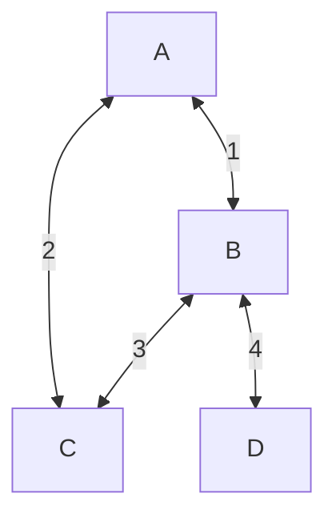
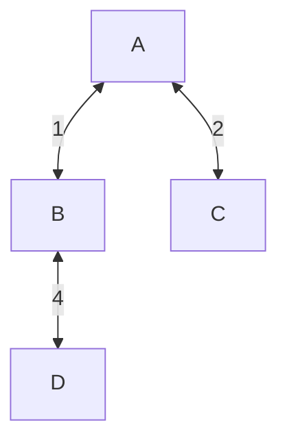
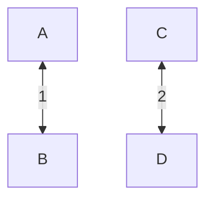
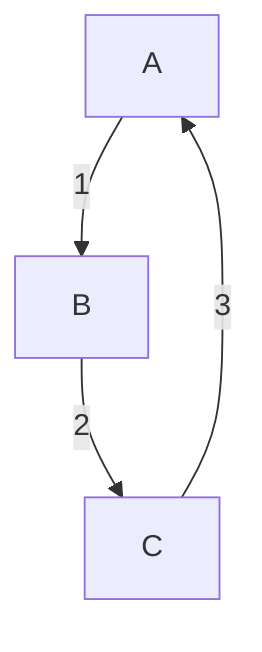
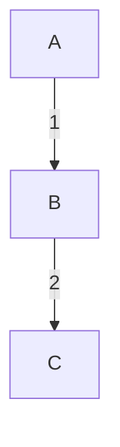
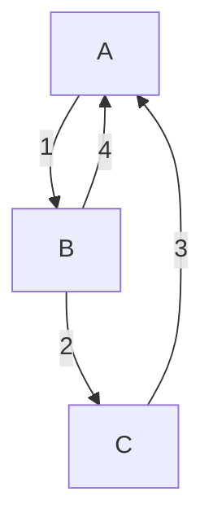
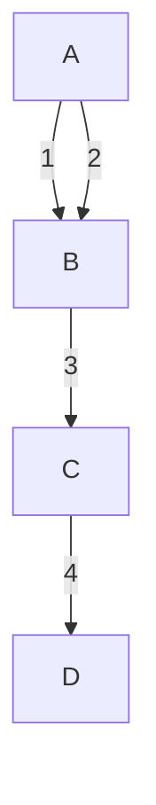
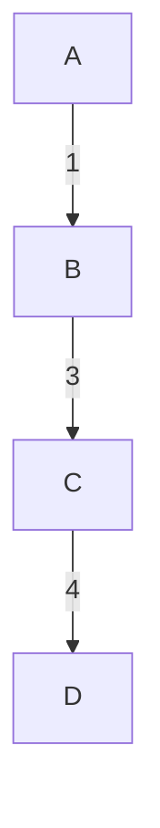

# Kruskal's Algorithm

Kruskal's Algorithm is a greedy algorithm used to find the minimum spanning tree of a connected, weighted graph. A spanning tree of a graph is a subgraph that is a tree (connected and acyclic) and includes all the vertices of the original graph. A minimum spanning tree is a spanning tree with the smallest total weight among all possible spanning trees.

### Examples

**1. Simple Undirected Weighted Graph:**



MST (Result of Kruskal's Algorithm):



**2. Disconnected Graph:**



MST (Result of Kruskal's Algorithm):


**3. Directed Graph:**



MST (Result of Kruskal's Algorithm):



**4. Weighted Graph with Loops:**



MST (Result of Kruskal's Algorithm):


**5. Weighted Graph with Parallel Edges:**



MST (Result of Kruskal's Algorithm):



**Pseudocode**:
```
function Kruskal(Graph):
    1. Sort the edges of the graph in non-decreasing order of weight.
    2. Initialize an empty minimum spanning tree (MST) and an empty set of disjoint sets.
    3. For each vertex v in the graph, create a disjoint set with v.
    4. For each edge (u, v) in the sorted list of edges:
        a. If u and v are not in the same disjoint set:
            i. Add (u, v) to the MST.
            ii. Merge the disjoint sets of u and v.
    5. Return the MST.
```

### Implementation

```java
import java.util.*;

class Edge implements Comparable<Edge> {
    int src, dest, weight;

    public Edge(int src, int dest, int weight) {
        this.src = src;
        this.dest = dest;
        this.weight = weight;
    }

    @Override
    public int compareTo(Edge other) {
        return this.weight - other.weight;
    }
}

class DisjointSet {
    int[] parent, rank;

    public DisjointSet(int size) {
        parent = new int[size];
        rank = new int[size];
        for (int i = 0; i < size; i++) {
            parent[i] = i;
            rank[i] = 0;
        }
    }

    public int find(int u) {
        if (u != parent[u])
            parent[u] = find(parent[u]);
        return parent[u];
    }

    public void union(int u, int v) {
        int rootU = find(u);
        int rootV = find(v);

        if (rank[rootU] > rank[rootV])
            parent[rootV] = rootU;
        else if (rank[rootU] < rank[rootV])
            parent[rootU] = rootV;
        else {
            parent[rootV] = rootU;
            rank[rootU]++;
        }
    }
}

public class KruskalsAlgorithm {
    public static List<Edge> kruskalsMST(List<Edge> edges, int numVertices) {
        List<Edge> mst = new ArrayList<>();
        Collections.sort(edges);

        DisjointSet disjointSet = new DisjointSet(numVertices);

        for (Edge edge : edges) {
            int src = edge.src;
            int dest = edge.dest;

            if (disjointSet.find(src) != disjointSet.find(dest)) {
                mst.add(edge);
                disjointSet.union(src, dest);
            }
        }

        return mst;
    }

    public static void main(String[] args) {
        // Example Usage:
        List<Edge> edges = new ArrayList<>();
        edges.add(new Edge(0, 1, 1));
        edges.add(new Edge(0, 2, 2));
        edges.add(new Edge(1, 2, 3));
        edges.add(new Edge(1, 3, 4));
        edges.add(new Edge(2, 3, 5));

        List<Edge> mst = kruskalsMST(edges, 4);

        System.out.println("Minimum Spanning Tree:");
        for (Edge edge : mst) {
            System.out.println(edge.src + " - " + edge.dest + " : " + edge.weight);
        }
    }
}

```

**Complexity**:

- The sorting of edges takes O(E log E) time.
- The disjoint set operations (checking for cycles, merging sets) take approximately O(E α(V)) time, where α(V) is the inverse Ackermann function.
- Overall, the time complexity is O(E log E + E α(V)), which is nearly O(E log E).

Kruskal's Algorithm is efficient and widely used for finding minimum spanning trees, especially in scenarios where the graph is sparse (i.e., has relatively few edges compared to the number of vertices).