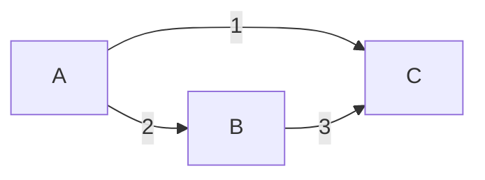
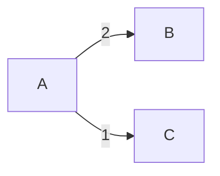
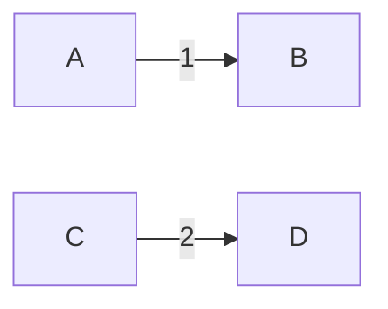
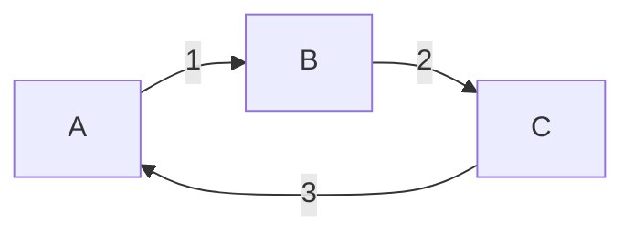
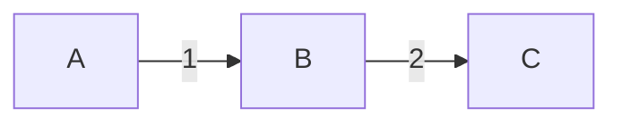
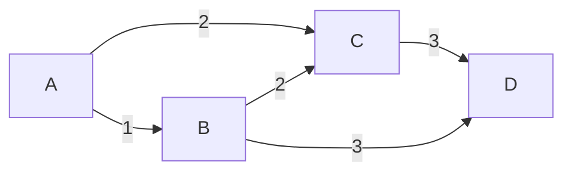
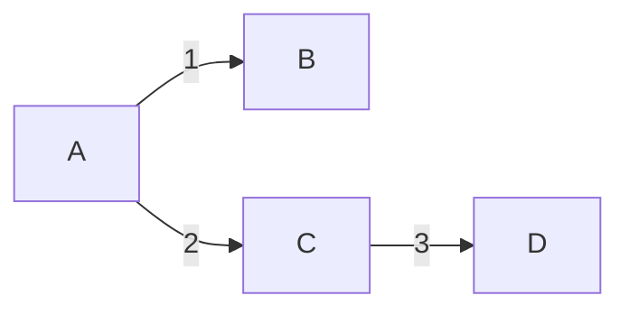

# Prim's Algorithm

Prim's algorithm is a greedy algorithm used to find the minimum spanning tree for a weighted, connected graph. A minimum spanning tree is a subset of the edges of a graph that forms a tree and spans all the vertices.

## Example

### Example 1: Simple Connected Graph

**Graph:**



**Result:**



### Example 2: Disconnected Graph

**Graph:**



**Result:**


### Example 3: Graph with Loops

**Graph:**



**Result:**



### Example 4: Graph with Multiple Minimum Spanning Trees

**Graph:**



**Result:**



### Example 5: Empty Graph

**Graph:**

```mermaid
graph LR;
```

**Result:**

```
Empty graph, no edges.
```

### Input:
1. **Graph G**: This is the input graph, represented by a set of vertices and edges, along with their associated weights.
2. **Starting Vertex**: The algorithm starts from an arbitrary vertex. This can be any vertex in the graph.

### Steps of Prim's Algorithm:

1. **Initialization**:
   - Create an empty set **MST** that will eventually contain the edges of the minimum spanning tree.
   - Create a set **visited** to keep track of which vertices have been visited. Initialize it with only the starting vertex.
   - Create a priority queue **PQ** (e.g., a min-heap) to store the edges based on their weights.

2. **Iterate**:
   - While the **visited** set is not equal to the set of all vertices in the graph:
     - For each vertex **v** in the **visited** set, consider all edges **e** that connect **v** to a vertex **u** not in **visited**.
     - Add these edges **e** to the priority queue **PQ**.

3. **Selecting the Minimum Weight Edge**:
   - In each iteration, select the edge **e** with the minimum weight from **PQ**. This edge will connect a visited vertex to an unvisited one.

4. **Updating visited set and MST**:
   - Add the selected edge **e** to the **MST**.
   - Add the unvisited vertex (the one connected by **e**) to the **visited** set.

5. **Repeat**:
   - Repeat steps 2 to 4 until all vertices are visited.

```java
import java.util.*;

class PrimAlgorithm {

    static class Edge {
        int src, dest, weight;

        public Edge(int src, int dest, int weight) {
            this.src = src;
            this.dest = dest;
            this.weight = weight;
        }
    }

    static void primMST(List<Edge>[] adjList, int V) {
        boolean[] visited = new boolean[V]; // Keeps track of visited vertices
        PriorityQueue<Edge> pq = new PriorityQueue<>(Comparator.comparingInt(e -> e.weight)); // Priority Queue for selecting minimum weight edges
        List<Edge> mstEdges = new ArrayList<>(); // List to store MST edges
        int startVertex = 0; // Start from vertex 0 (can be any vertex)

        visited[startVertex] = true; // Mark the starting vertex as visited

        // Add all edges from the starting vertex to the priority queue
        for (Edge edge : adjList[startVertex]) {
            pq.add(edge);
        }

        while (!pq.isEmpty()) {
            Edge edge = pq.poll(); // Get the edge with minimum weight
            int u = edge.src;
            int v = edge.dest;

            if (visited[u] && !visited[v]) {
                visited[v] = true; // Mark the newly visited vertex
                mstEdges.add(edge); // Add the edge to the MST

                // Add all edges from the newly visited vertex to the priority queue
                for (Edge nextEdge : adjList[v]) {
                    if (!visited[nextEdge.dest]) {
                        pq.add(nextEdge);
                    }
                }
            }
        }

        // Print the MST edges
        for (Edge edge : mstEdges) {
            System.out.println(edge.src + " - " + edge.dest + " : " + edge.weight);
        }
    }

    public static void main(String[] args) {
        int V = 5; // Number of vertices

        // Create adjacency list representation of the graph
        List<Edge>[] adjList = new ArrayList[V];
        for (int i = 0; i < V; i++) {
            adjList[i] = new ArrayList<>();
        }

        // Add edges with their weights
        adjList[0].add(new Edge(0, 1, 2));
        adjList[0].add(new Edge(0, 2, 1));
        adjList[1].add(new Edge(1, 2, 3));
        adjList[1].add(new Edge(1, 3, 1));
        adjList[2].add(new Edge(2, 3, 2));

        primMST(adjList, V); // Call the Prim's MST function
    }
}
```

### Complexity Analysis

- **Time Complexity**: The time complexity of the Prim's algorithm implemented using a binary heap (as in this Java code) is O(E log V), where E is the number of edges and V is the number of vertices.

- **Space Complexity**: The space complexity is O(V + E), where V is the number of vertices and E is the number of edges.