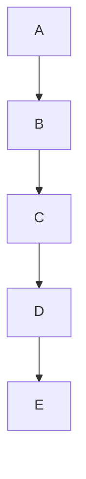
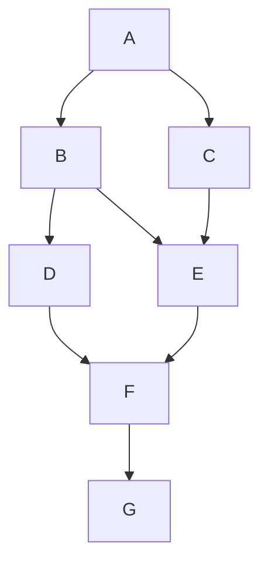
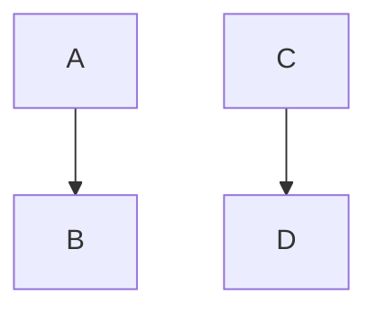
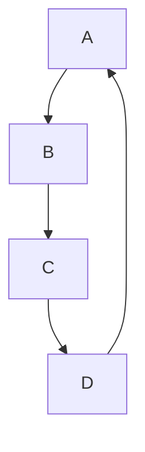

# Topological Sorting 

Topological sorting is a linear ordering of the vertices in a directed acyclic graph (DAG) such that for every directed edge `(u, v)`, vertex `u` comes before vertex `v` in the ordering. In simpler terms, it helps organize tasks or elements in a way that respects the dependencies between them.

## Applications

Topological sorting has several practical applications:

- **Task Scheduling:** In project management, tasks often have dependencies on each other. Topological sorting helps in determining a valid order of execution.

- **Compiler Design:** Compilers use topological sorting during code generation to ensure that all dependencies (like variable declarations and definitions) are resolved correctly.

- **Package Management:** Package managers like npm, pip, and others use topological sorting to install packages in the correct order, ensuring that dependencies are met.

- **Course Scheduling:** In academic institutions, where courses have prerequisites, topological sorting helps in scheduling courses such that students can take them in the correct order.

## Limitations

Topological sorting is applicable only to directed acyclic graphs (DAGs).A DAG is a graph in which there are no cycles, meaning you can't start at a vertex and follow a sequence of directed edges to return to that same vertex.

 It cannot be applied to graphs with cycles because there's no way to order the vertices such that all edges point in the correct direction.

## Examples

### Chain



Topological Sorting Result: A, B, C, D, E

### Fork


Topological Sorting Result: A, B, C, D

### Diamond


Topological Sorting Result: A, B, C, D

### Complex DAG



Topological Sorting Result: A, C, B, E, D, F, G

### Disconnected Components



Topological Sorting Result: A, C, B, D

### Cyclic Graph



This graph contains a cycle, so topological sorting is not possible.

## Implementation

### Kahn's Algorithm

```java
import java.util.*;

public class TopologicalSort {

    public static List<Character> topologicalSort(Map<Character, List<Character>> graph) {
        // Step 1: Initialize in-degree and queue
        Map<Character, Integer> inDegree = new HashMap<>();
        Queue<Character> queue = new LinkedList<>();

        // Initialize in-degrees for each node
        for (char node : graph.keySet()) {
            inDegree.put(node, 0);
        }

        // Calculate in-degrees
        for (List<Character> neighbors : graph.values()) {
            for (char neighbor : neighbors) {
                inDegree.put(neighbor, inDegree.get(neighbor) + 1);
            }
        }

        // Find nodes with no incoming edges (in-degree == 0) and add them to the queue
        for (char node : inDegree.keySet()) {
            if (inDegree.get(node) == 0) {
                queue.offer(node);
            }
        }

        // Step 2: Perform topological sorting
        List<Character> result = new ArrayList<>();
        while (!queue.isEmpty()) {
            char node = queue.poll();
            result.add(node);

            // Update in-degrees and add newly isolated nodes to the queue
            for (char neighbor : graph.get(node)) {
                inDegree.put(neighbor, inDegree.get(neighbor) - 1);
                if (inDegree.get(neighbor) == 0) {
                    queue.offer(neighbor);
                }
            }
        }

        // Step 3: Check if topological sorting is possible
        if (result.size() == graph.size()) {
            return result;
        } else {
            return null; // Graph has a cycle, topological sorting is not possible
        }
    }

    public static void main(String[] args) {
        // Example Usage
        Map<Character, List<Character>> graph = new HashMap<>();
        graph.put('A', Arrays.asList('B', 'C'));
        graph.put('B', Collections.singletonList('D'));
        graph.put('C', Collections.singletonList('D'));

        List<Character> sortedOrder = topologicalSort(graph);

        if (sortedOrder != null) {
            System.out.println("Topological Sorting Result: " + sortedOrder);
        } else {
            System.out.println("The graph has a cycle. Topological sorting is not possible.");
        }
    }
}

```

```python
from collections import defaultdict, deque

def topological_sort(graph):
    in_degree = {node: 0 for node in graph}
    for node in graph:
        for neighbor in graph[node]:
            in_degree[neighbor] += 1

    queue = deque([node for node in in_degree if in_degree[node] == 0])
    result = []

    while queue:
        node = queue.popleft()
        result.append(node)

        for neighbor in graph[node]:
            in_degree[neighbor] -= 1
            if in_degree[neighbor] == 0:
                queue.append(neighbor)

    if len(result) == len(graph):
        return result
    else:
        return None

# Example Usage
graph = {
    'A': ['B', 'C'],
    'B': ['D'],
    'C': ['D']
}

sorted_order = topological_sort(graph)
if sorted_order:
    print("Topological Sorting Result:", sorted_order)
else:
    print("The graph has a cycle. Topological sorting is not possible.")

```

```go
package main

import (
	"fmt"
)

func topologicalSort(graph map[string][]string) []string {
	inDegree := make(map[string]int)
	queue := []string{}

	// Step 1: Initialize in-degrees and queue
	for node := range graph {
		inDegree[node] = 0
	}

	// Calculate in-degrees
	for _, neighbors := range graph {
		for _, neighbor := range neighbors {
			inDegree[neighbor]++
		}
	}

	// Find nodes with no incoming edges (in-degree == 0) and add them to the queue
	for node, degree := range inDegree {
		if degree == 0 {
			queue = append(queue, node)
		}
	}

	// Step 2: Perform topological sorting
	var result []string
	for len(queue) > 0 {
		node := queue[0]
		queue = queue[1:]
		result = append(result, node)

		// Update in-degrees and add newly isolated nodes to the queue
		for _, neighbor := range graph[node] {
			inDegree[neighbor]--
			if inDegree[neighbor] == 0 {
				queue = append(queue, neighbor)
			}
		}
	}

	// Step 3: Check if topological sorting is possible
	if len(result) == len(graph) {
		return result
	} else {
		return nil // Graph has a cycle, topological sorting is not possible
	}
}

func main() {
	// Example Usage
	graph := map[string][]string{
		"A": {"B", "C"},
		"B": {"D"},
		"C": {"D"},
	}

	sortedOrder := topologicalSort(graph)

	if sortedOrder != nil {
		fmt.Println("Topological Sorting Result:", sortedOrder)
	} else {
		fmt.Println("The graph has a cycle. Topological sorting is not possible.")
	}
}
```

### Complexity Analysis

Kahn's Algorithm for topological sorting has a time complexity of O(V + E), where V is the number of vertices and E is the number of edges in the graph.

1. **Initialization and In-Degree Calculation:**
   - For each vertex, we initialize the in-degree to 0, which takes O(V) operations.
   - Then, we iterate through the edges to calculate the in-degrees. This takes O(E) operations.

2. **Finding Nodes with No Incoming Edges:**
   - In the worst case, all vertices could have no incoming edges, which would take O(V) operations.

3. **Performing Topological Sorting:**
   - In the worst case, we process each edge once, which takes O(E) operations.
   - For each edge, we may add a node to the result list and update the in-degrees, which takes constant time.

4. **Checking if Topological Sorting is Possible:**
   - After the loop, we check if the result list contains all vertices, which takes O(V) operations.

Overall, the time complexity is dominated by the calculations involving the edges, giving us a total time complexity of O(V + E).

The space complexity of Kahn's Algorithm is O(V), primarily due to the data structures used to store in-degrees and the queue.


### Depth First Search

```java
import java.util.*;

public class TopologicalSortDFS {

    public static List<Character> topologicalSort(Map<Character, List<Character>> graph) {
        Set<Character> visited = new HashSet<>();
        Stack<Character> stack = new Stack<>();

        // Step 1: Perform DFS on each unvisited node
        for (char node : graph.keySet()) {
            if (!visited.contains(node)) {
                dfs(node, visited, stack, graph);
            }
        }

        // Step 2: Extract result from stack
        List<Character> result = new ArrayList<>();
        while (!stack.isEmpty()) {
            result.add(stack.pop());
        }

        return result;
    }

    private static void dfs(char node, Set<Character> visited, Stack<Character> stack, Map<Character, List<Character>> graph) {
        visited.add(node);

        // Step 3: Visit neighbors recursively
        if (graph.containsKey(node)) {
            for (char neighbor : graph.get(node)) {
                if (!visited.contains(neighbor)) {
                    dfs(neighbor, visited, stack, graph);
                }
            }
        }

        // Step 4: Push the current node to the stack
        stack.push(node);
    }

    public static void main(String[] args) {
        // Example Usage
        Map<Character, List<Character>> graph = new HashMap<>();
        graph.put('A', Arrays.asList('B', 'C'));
        graph.put('B', Collections.singletonList('D'));
        graph.put('C', Collections.singletonList('D'));

        List<Character> sortedOrder = topologicalSort(graph);

        if (!sortedOrder.isEmpty()) {
            System.out.println("Topological Sorting Result: " + sortedOrder);
        } else {
            System.out.println("The graph has a cycle. Topological sorting is not possible.");
        }
    }
}
```

```python
def topological_sort_dfs(graph):
    visited = set()
    stack = []

    def dfs(node):
        visited.add(node)

        # Visit neighbors recursively
        if node in graph:
            for neighbor in graph[node]:
                if neighbor not in visited:
                    dfs(neighbor)

        # Push the current node to the stack
        stack.append(node)

    # Perform DFS on each unvisited node
    for node in graph:
        if node not in visited:
            dfs(node)

    # Extract result from stack
    result = stack[::-1]
    return result

# Example Usage
graph = {
    'A': ['B', 'C'],
    'B': ['D'],
    'C': ['D']
}

sorted_order = topological_sort_dfs(graph)

if sorted_order:
    print("Topological Sorting Result:", sorted_order)
else:
    print("The graph has a cycle. Topological sorting is not possible.")

```

```go
package main

import "fmt"

func topologicalSortDFS(graph map[string][]string) []string {
	visited := make(map[string]bool)
	stack := []string{}

	var dfs func(node string)
	dfs = func(node string) {
		visited[node] = true

		// Visit neighbors recursively
		for _, neighbor := range graph[node] {
			if !visited[neighbor] {
				dfs(neighbor)
			}
		}

		// Push the current node to the stack
		stack = append(stack, node)
	}

	// Perform DFS on each unvisited node
	for node := range graph {
		if !visited[node] {
			dfs(node)
		}
	}

	// Extract result from stack
	result := []string{}
	for i := len(stack) - 1; i >= 0; i-- {
		result = append(result, stack[i])
	}

	return result
}

func main() {
	// Example Usage
	graph := map[string][]string{
		"A": {"B", "C"},
		"B": {"D"},
		"C": {"D"},
	}

	sortedOrder := topologicalSortDFS(graph)

	if len(sortedOrder) > 0 {
		fmt.Println("Topological Sorting Result:", sortedOrder)
	} else {
		fmt.Println("The graph has a cycle. Topological sorting is not possible.")
	}
}
```

### Complexity Analysis

**Time Complexity:**

The time complexity of the DFS-based topological sorting algorithm is O(V + E), where V is the number of vertices and E is the number of edges in the graph. This is because, in the worst case, the algorithm must visit every vertex and edge once.

- Visiting a vertex takes constant time (O(1)).
- Visiting an edge takes constant time (O(1)).
- Since we may visit every vertex and edge once, the overall time complexity is O(V + E).

**Space Complexity:**

The space complexity of the DFS implementation is O(V + E), where V is the number of vertices and E is the number of edges in the graph. This space is primarily used for:

- The `visited` set (O(V)) to keep track of visited nodes.
- The `stack` (O(V)) used for the depth-first search.
- Recursive call stack for the DFS (O(V)).

In practice, the space complexity can vary depending on the specific graph structure and the order in which nodes are visited. However, the worst-case space complexity is O(V + E).